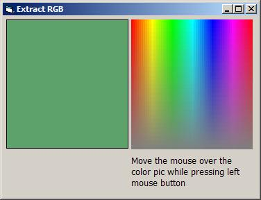



## Extract RGB with CopyMemory

### Description

Extract RGB components with CopyMemory & GetPixel API functions. Just a few lines of code. Comments and suggestions are welcome.
 
### More Info
 

             |
---                |---
**Submitted On**   |2003-05-15 15:12:16
**By**             |[Min Thant Sin](https://github.com/Planet-Source-Code/PSCIndex/blob/master/ByAuthor/min-thant-sin.md)
**Level**          |Beginner
**User Rating**    |5.0 (10 globes from 2 users)
**Compatibility**  |VB 6\.0
**Category**       |[Graphics](https://github.com/Planet-Source-Code/PSCIndex/blob/master/ByCategory/graphics__1-46.md)
**World**          |[Visual Basic](https://github.com/Planet-Source-Code/PSCIndex/blob/master/ByWorld/visual-basic.md)
**Archive File**   |[Extract\_RG1588345152003\.zip](https://github.com/Planet-Source-Code/min-thant-sin-extract-rgb-with-copymemory__1-45495/archive/master.zip)

